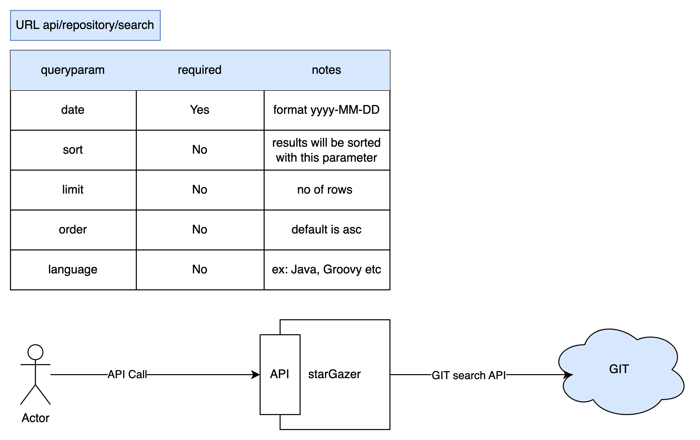

# stargazer

## setup
to use JDK 17:

```shell
export JAVA_HOME="$(/usr/libexec/java_home -v17)"
```

## Architecture




## How to test the API?

### Scenario: find A list of the most popular repositories, sorted by number of stars.

```shell
curl -X GET 'http://localhost:8080/api/repository/search?date=2021-01-10&sort=stars&order=desc'
```

### Scenario: view the top 10, 50, 100 repositories 

```shell
curl -X GET 'http://localhost:8080/api/repository/search?date=2021-01-10&limit=10&order=desc'
```

### Scenario: filter for the programming language to find based on language

```shell
curl -X GET 'http://localhost:8080/api/repository/search?date=2021-01-10&language=Python'
```

## TODO
add Unit test and function tests